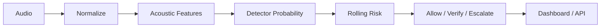

# VoiceCloneGuard

**AI voice deepfake detection and risk assessment for voice-based impersonation attacks.**

VoiceCloneGuard is a Smart India Hackathon (SIH) prototype that extends a conventional voice-cloning classifier into a security workflow. Instead of returning only a binary label, the system analyzes audio in rolling windows, aggregates evidence over time, and maps the current risk state to a safer operational action: **Allow, Verify, or Escalate**.

> **Prototype status:** The detector is a research/demo system. A model score is evidence, not proof of a person's identity. High-risk results should trigger independent verification rather than automatic accusations or irreversible actions.

---

## Project Information

| Field | Value |
|---|---|
| Project | VoiceCloneGuard |
| SIH Problem ID | SIH26104 |
| Problem theme | AI-powered detection and prevention of voice-cloning impersonation attacks |
| Category | Software |
| Primary interface | Streamlit dashboard |
| Backend | FastAPI |
| Core ML | scikit-learn Random Forest |
| Audio pipeline | librosa + FFmpeg |

---

## Problem

Modern text-to-speech and voice-conversion systems can generate convincing synthetic speech from short reference recordings. This creates a practical security problem for phone calls, customer support, financial workflows, family-member impersonation, and other voice-mediated interactions.

A useful defensive system needs more than a single confidence number. It should process noisy real-world audio, preserve uncertainty, aggregate evidence across time, and translate model output into a proportionate security response.

---

## Proposed Solution

VoiceCloneGuard adds a security-oriented layer around the underlying detector:

1. **Audio input** — upload WAV/FLAC or other supported formats.
2. **Normalization** — decode, convert, resample to 16 kHz mono, and validate the signal.
3. **Acoustic analysis** — use the original MFCC detector or the richer prototype feature pipeline.
4. **Rolling evidence** — analyze overlapping 4-second windows with a 1-second hop by default.
5. **Risk fusion** — smooth recent evidence and optionally incorporate context such as transaction risk.
6. **Action policy** — return `allow`, `verify`, or `escalate`.
7. **Privacy-safe evidence** — return metadata without retaining the uploaded audio.

---

## Architecture



See [docs/architecture.md](docs/architecture.md) for implementation details.

---

## Key Features

- Rolling-window voice analysis
- Temporal risk smoothing
- Conservative verification workflow
- Optional context-aware policy
- Original model compatibility
- Rich acoustic feature prototype
- WAV/FLAC/MP3/OGG/M4A/AAC support
- FastAPI REST API
- WebSocket streaming contract
- Streamlit security dashboard
- Privacy-first temporary audio handling
- Unit and API tests
- Docker + FFmpeg support

---

## Model implementations

### Original detector

The repository's original model consumes **13 mean MFCC features** and uses the trained `voice_cloning_model.pkl` classifier. The original detector convention is **class 0 = AI-cloned** and **class 1 = real**.

### Improved prototype

`train_improved_model.py` adds richer acoustic statistics:

- MFCC mean and standard deviation
- Delta and delta-delta statistics
- Spectral centroid
- Spectral bandwidth
- Spectral rolloff
- Zero-crossing rate
- RMS energy
- Spectral contrast

The improved artifact uses **class 0 = real** and **class 1 = AI-cloned**.

The application prefers `models/improved_voice_model.pkl` when it exists and falls back to `models/voice_cloning_model.pkl`.

> The current repository intentionally does not commit model binaries by default. Put the artifact in `models/` locally or manage it through an appropriate model registry/storage system.

---

## Technology Stack

- **Python 3.11**
- **FastAPI** — backend API
- **Streamlit** — dashboard
- **scikit-learn** — Random Forest classifier
- **librosa** — audio loading and acoustic features
- **FFmpeg** — audio format conversion
- **Matplotlib** — visualization support
- **pytest** — automated tests
- **Docker** — containerized API runtime

---

## Repository Structure

```text
VoiceCloneGuard/
├── README.md
├── LICENSE
├── SUBMISSION_GUIDE.md
├── requirements.txt
├── packages.txt
├── Dockerfile
├── .dockerignore
├── .gitignore
├── dashboard.py
├── evaluate_model.py
├── train_improved_model.py
├── scripts/
│   ├── demo_model.py
│   └── demo_rolling.py
├── app/
│   ├── __init__.py
│   ├── config.py
│   ├── feature_extractor.py
│   ├── improved_model_adapter.py
│   ├── main.py
│   ├── model_adapter.py
│   ├── models.py
│   ├── privacy.py
│   └── risk_engine.py
├── docs/
│   ├── api.md
│   └── architecture.md
├── models/
│   └── README.md
├── tests/
│   ├── test_api.py
│   └── test_risk_engine.py
├── submission/
│   ├── DEMO.md
│   └── PRESENTATION.md
└── assets/
    └── screenshots/
```

---

## Installation

### 1. Clone

```bash
git clone https://github.com/Mohit-git22/VoiceCloneGuard.git
cd VoiceCloneGuard
```

### 2. Create a virtual environment

```bash
python -m venv .venv
```

Windows PowerShell:

```powershell
.\.venv\Scripts\python.exe -m pip install -r requirements.txt
```

### 3. Add a model artifact

Copy either:

```text
models/voice_cloning_model.pkl
```

or:

```text
models/improved_voice_model.pkl
```

into the `models/` directory.

### 4. Ensure FFmpeg is available

Windows:

```powershell
ffmpeg -version
```

Linux/macOS:

```bash
ffmpeg -version
```

You can override the executable with `FFMPEG_BIN`.

---

## Run the API

```bash
.\.venv\Scripts\python.exe -m uvicorn app.main:app --reload
```

Open:

- API: `http://127.0.0.1:8000`
- Swagger docs: `http://127.0.0.1:8000/docs`

Check health:

```powershell
Invoke-RestMethod http://127.0.0.1:8000/health
```

---

## Run the dashboard

In a second terminal:

```powershell
.\.venv\Scripts\python.exe -m streamlit run dashboard.py
```

Open:

`http://localhost:8501`

Set a different API URL with:

```powershell
$env:VCG_API_URL = "http://127.0.0.1:8000"
```

---

## Train the improved prototype

Prepare:

```text
evaluation_data/
├── real/
│   ├── real_01.wav
│   └── ...
└── fake/
    ├── fake_01.wav
    └── ...
```

Then:

```bash
python train_improved_model.py --data evaluation_data --output models/improved_voice_model.pkl
```

For a serious benchmark, keep independent train/validation/test data, avoid speaker leakage, and use genuine synthetic speech from multiple generation systems rather than arbitrary AI-generated sound effects.

---

## Evaluation

Run:

```bash
python evaluate_model.py --model models/voice_cloning_model.pkl --data evaluation_data
```

Do not report the resulting numbers as a production accuracy benchmark unless the dataset, class definitions, split protocol, speaker separation, and provenance are documented.

---

## Tests

```bash
python -m pytest -q
```

The policy and API tests do not require a model artifact for the basic endpoints.

---

## API

See [docs/api.md](docs/api.md).

Core endpoints:

- `GET /health`
- `POST /score`
- `POST /analyze`
- `WS /stream`

---

## Privacy and Security Design

VoiceCloneGuard follows a privacy-first prototype pattern:

- Uploaded audio is processed through temporary files.
- Temporary server-side files are deleted after analysis.
- Returned evidence is metadata-only.
- Raw audio is not written to the application event log.
- A detection score should not be treated as proof of identity.
- High-risk results should trigger an independent verification step.

---

## Current Limitations

The current prototype still has important limitations:

- The improved model is a small classical-ML prototype, not a production-grade deepfake detector.
- Dedicated OOD detection is **not yet implemented**; the API keeps an OOD hook for future work.
- Dedicated speaker verification/embedding fusion is **not yet implemented**.
- The quality of any benchmark depends strongly on the evaluation dataset and labeling protocol.
- The prototype does not yet integrate directly with a live telephony stack.

---

## Future Work

1. Train on larger, diverse anti-spoofing datasets such as ASVspoof and multilingual synthetic-speech collections.
2. Add pretrained speech embeddings and a dedicated OOD detector.
3. Add speaker-verification consistency scoring.
4. Calibrate probabilities on a held-out validation set.
5. Add streaming call-center/VoIP integration.
6. Add audit-ready monitoring and model/version tracking.
7. Evaluate robustness across languages, codecs, microphones, noise levels, and unseen synthesis systems.

---

## SIH Submission

See [SUBMISSION_GUIDE.md](SUBMISSION_GUIDE.md), [submission/PRESENTATION.md](submission/PRESENTATION.md), and [submission/DEMO.md](submission/DEMO.md).

---

## License

MIT — see [LICENSE](LICENSE).
