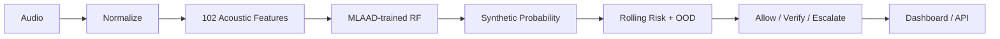

# VoiceCloneGuard

**AI voice deepfake detection and impersonation-risk assessment for voice-based attacks.**

VoiceCloneGuard is a Smart India Hackathon (SIH) prototype that combines a machine-learning voice authenticity detector with a security-oriented decision workflow. Instead of returning only a binary label, the system analyzes audio in rolling windows, produces a synthetic-voice likelihood, checks whether the audio is acoustically unfamiliar to its reference distribution, and maps the combined evidence to **Allow, Verify, or Escalate**.

> **Prototype status:** This is a research/demo system. A model score is evidence, not proof of a person's identity. Uncertain or high-risk results should trigger independent verification.
>
> LIVE APPLICATION : https://voice-cloning-guard-sih26.streamlit.app/
> PPT : https://onedrive.live.com/?id=%2Fpersonal%2Ff0430da4c9255c3e%2FDocuments%2FFrom%20Canva%2FDOC%2D20260910%2DWA0018%2Epptx%2Epdf&listurl=%2Fpersonal%2Ff0430da4c9255c3e%2FDocuments&ithint=file%2Cpdf&e=Rtfnlb&migratedtospo=true&parent=%2Fpersonal%2Ff0430da4c9255c3e%2FDocuments%2FFrom%20Canva&redeem=aHR0cHM6Ly8xZHJ2Lm1zL2IvYy9mMDQzMGRhNGM5MjU1YzNlL0lRQ2hzVTd1dzY4TVE2bEhSc28yZHdvWEFmaHYtUzdacWtacjhhM1FONFE2OEFJP2U9UnRmbmxi&ga=1

---

## Project Information

| Field | Value |
|---|---|
| Project | VoiceCloneGuard |
| SIH Problem ID | SIH26104 |
| Problem theme | AI-powered detection and prevention of voice-cloning impersonation attacks |
| Category | Software |
| Primary interface | Streamlit dashboard |
| Backend | FastAPI |
| Core ML | scikit-learn Random Forest |
| Acoustic representation | 102 rich acoustic features |
| Training corpus | MLAAD-tiny — 15,290 audio files |
| Audio pipeline | librosa + FFmpeg |

---

## Problem

Modern text-to-speech and voice-conversion systems can generate convincing synthetic speech from short reference recordings. This creates a practical security problem for phone calls, customer support, financial workflows, family-member impersonation, and other voice-mediated interactions.

A defensive system needs more than a single score. It should handle variable audio, aggregate evidence over time, expose uncertainty, and translate model output into a proportionate security response.

---

## Proposed Solution

VoiceCloneGuard combines five layers:

1. **Audio input** — upload or record speech.
2. **Normalization** — decode, convert where required, load as mono audio, and prepare the signal for analysis.
3. **Acoustic detector** — extract 102 rich acoustic features and evaluate them with the trained Random Forest.
4. **Evidence layer** — analyze overlapping windows, smooth the detector signal over time, and calculate calibrated OOD/domain-familiarity evidence.
5. **Risk policy** — map the evidence to `ALLOW`, `VERIFY`, or `ESCALATE`.

The OOD signal is treated as a **secondary uncertainty/domain signal**. It does not change the Random Forest's underlying synthetic-voice probability.

---

## Architecture



Default rolling analysis:

- **Window:** 4 seconds
- **Hop:** 1 second

---

## Key Features

### Detection and risk

- 102-feature acoustic representation
- Random Forest deepfake detector
- Rolling-window analysis
- Temporal risk smoothing
- Conservative `ALLOW / VERIFY / ESCALATE` policy
- Optional transaction-risk context
- OOD/domain-familiarity evidence
- Window-level evidence reporting
- Tail-window coverage for complete uploads

### Audio support

- WAV
- FLAC
- MP3
- OGG
- M4A
- AAC
- MPEG
- MPG

### Product and interface

- FastAPI REST API
- WebSocket streaming contract
- Streamlit security dashboard
- Live microphone recording
- Upload-based analysis
- Waveform visualization
- Mel spectrogram
- MFCC heatmap
- Forensic acoustic diagnostics
- 102-dimensional feature inspection
- Analysis history
- Privacy-oriented temporary-file handling

### Supporting forensic diagnostics

The dashboard also calculates additional acoustic measurements for inspection and explanation:

- Fundamental frequency (F0)
- Voiced ratio
- Harmonic/noise ratio proxy
- Spectral flux
- Approximate F1/F2/F3 formants
- Jitter proxy
- Shimmer proxy
- Within-recording segment consistency

These are **supporting diagnostics**. They are not presented as standalone proof of AI generation, and the jitter/shimmer/formant calculations are prototype-level estimates.

---

## Machine-Learning Model

### Original detector

The repository's original detector uses:

- 13 mean MFCC features
- The original `voice_cloning_model.pkl`
- Original class convention: **class 0 = AI-cloned, class 1 = real**

It remains supported as a fallback model.

### Current improved detector

The current deployed prototype uses:

**102 rich acoustic features:**

- 13 MFCC means
- 13 MFCC standard deviations
- 13 delta-MFCC means
- 13 delta-MFCC standard deviations
- 13 delta-delta means
- 13 delta-delta standard deviations
- Spectral centroid mean/std
- Spectral bandwidth mean/std
- Spectral rolloff mean/std
- Zero-crossing-rate mean/std
- RMS energy mean/std
- 7 spectral-contrast means
- 7 spectral-contrast standard deviations

The improved model uses:

- **Class 0 = real**
- **Class 1 = AI-cloned**

The application prefers:

```text
models/improved_voice_model.pkl
```

and falls back to:

```text
models/voice_cloning_model.pkl
```

---

## MLAAD Training and Evaluation

The current improved model was trained using the **MLAAD-tiny** corpus:

```text
Total: 15,290 audio files
Original / bona-fide: 7,390
Fake / spoof:          7,900
```

The feature pipeline successfully produced:

```text
15,290 × 102 feature matrix
0 extraction failures
```

The final Random Forest was selected using a validation comparison and then retrained on the combined training + validation partition.

### Held-out test result

On the untouched test set:

| Metric | Result |
|---|---:|
| **Accuracy** | **91.37%** |
| **Precision** | **86.50%** |
| **Recall** | **98.70%** |
| **F1** | **92.20%** |
| **ROC-AUC** | **97.84%** |

Test confusion matrix:

```text
                 Predicted
                 Real   Fake
Actual Real       782    154
Actual Fake        13    987
```

The reported metrics above come from the current MLAAD experiment. They should **not** be interpreted as universal real-world accuracy across every language, microphone, codec, recording environment, or unseen synthesis system.

---

## OOD / Domain Familiarity

The current prototype includes a separate **OOD (out-of-distribution) detector** based on the same 102-feature representation.

Its role is different from the deepfake classifier:

```text
Random Forest
    ↓
Synthetic-voice likelihood

OOD detector
    ↓
Domain familiarity / unfamiliarity
```

The OOD result is used as a secondary security signal. When an input is acoustically far from the reference distribution, the system can prefer **VERIFY** rather than automatically escalating solely because the classifier score is high.

### Important limitation

OOD is a **domain-familiarity signal**, not an independent proof that audio is fake. A recording can be unfamiliar because of microphone characteristics, messaging compression, language, channel conditions, or other acquisition differences.

---

## Risk Engine

VoiceCloneGuard uses a rolling risk engine to aggregate recent detector scores.

Default behavior:

```text
Synthetic signal elevated
        +
High-confidence/familiar-domain evidence
        ↓
Higher risk

High OOD / unfamiliar domain
        ↓
Verification-first policy
```

The risk engine supports:

- Temporal smoothing across recent windows
- Synthetic-score thresholds
- OOD-aware uncertainty
- Transaction-risk context
- Verified-contact context
- `ALLOW`
- `VERIFY`
- `ESCALATE`

The classifier probability itself remains separate from the policy decision.

---

## Dashboard

The Streamlit dashboard is designed as a security-analysis console rather than a simple classifier demo.

### Main workspace

- Upload audio
- Record live voice
- Analyze through the FastAPI backend
- View waveform
- View spectrogram
- View MFCC map
- Inspect forensic diagnostics
- Inspect the 102-feature vector

### Result view

The dashboard separates:

- **AI Likelihood** — synthetic probability from the trained detector
- **Model Confidence** — strength of the detector score
- **Domain Familiarity** — whether the audio resembles the reference distribution
- **Risk Score** — policy-level risk
- **Decision** — Allow / Verify / Escalate

This separation is intentional: unfamiliar audio should not automatically be described as fake.

---

## Technology Stack

- **Python 3.11**
- **FastAPI** — backend API
- **Streamlit** — security dashboard
- **scikit-learn** — Random Forest and evaluation utilities
- **librosa** — audio decoding and acoustic feature extraction
- **FFmpeg** — format conversion
- **NumPy / Pandas** — feature and result handling
- **Matplotlib** — acoustic visualizations
- **pytest** — automated tests
- **Docker** — containerized API runtime

---

## Repository Structure

```text
VoiceCloneGuard/
├── README.md
├── LICENSE
├── SUBMISSION_GUIDE.md
├── requirements.txt
├── packages.txt
├── Dockerfile
├── .dockerignore
├── .gitignore
├── dashboard.py
├── evaluate_model.py
├── train_improved_model.py
├── scripts/
│   ├── demo_model.py
│   └── demo_rolling.py
├── app/
│   ├── __init__.py
│   ├── config.py
│   ├── feature_extractor.py
│   ├── improved_model_adapter.py
│   ├── main.py
│   ├── model_adapter.py
│   ├── models.py
│   ├── ood_detector.py
│   ├── privacy.py
│   └── risk_engine.py
├── docs/
│   ├── api.md
│   └── architecture.md
├── models/
│   └── README.md
├── tests/
│   ├── test_api.py
│   └── test_risk_engine.py
├── submission/
│   ├── DEMO.md
│   └── PRESENTATION.md
└── assets/
    └── screenshots/
```

---

## Installation

### 1. Clone

```bash
git clone https://github.com/Mohit-git22/VoiceCloneGuard.git
cd VoiceCloneGuard
```

### 2. Create a virtual environment

```bash
python -m venv .venv
```

Windows PowerShell:

```powershell
.\.venv\Scripts\python.exe -m pip install -r requirements.txt
```

### 3. Add the model artifact

Place:

```text
models/improved_voice_model.pkl
```

in the `models/` directory.

The original model can be used as a fallback:

```text
models/voice_cloning_model.pkl
```

The improved model binary is intentionally not required to be committed to source control.

### 4. Ensure FFmpeg is available

Windows:

```powershell
ffmpeg -version
```

Linux/macOS:

```bash
ffmpeg -version
```

You can override the executable with:

```text
FFMPEG_BIN
```

---

## Run the API

```bash
.\.venv\Scripts\python.exe -m uvicorn app.main:app --reload
```

Endpoints:

- API: `http://127.0.0.1:8000`
- Swagger: `http://127.0.0.1:8000/docs`

Health check:

```powershell
Invoke-RestMethod http://127.0.0.1:8000/health
```

The health endpoint reports model connectivity, model type, OOD connectivity, feature count/version, and rolling-window configuration.

---

## Run the Dashboard

In a second terminal:

```powershell
.\.venv\Scripts\python.exe -m streamlit run dashboard.py
```

Open:

```text
http://localhost:8501
```

For a local API:

```powershell
$env:VCG_API_URL = "http://127.0.0.1:8000"
```

---

## API

Core endpoints:

- `GET /health`
- `POST /score`
- `POST /analyze`
- `WS /stream`

The main `/analyze` flow:

```text
Upload
  ↓
Decode / convert
  ↓
Mono audio
  ↓
Rolling windows
  ↓
102-feature extraction
  ↓
Random Forest
  ↓
OOD evidence
  ↓
Rolling risk policy
  ↓
Response + evidence
```

See [docs/api.md](docs/api.md) for endpoint details.

---

## Privacy and Security Design

VoiceCloneGuard follows a privacy-oriented prototype pattern:

- Uploaded audio is processed using temporary files.
- Temporary server-side files are deleted after analysis.
- Raw audio is not written to application event logs.
- Returned evidence is metadata-oriented.
- Analysis results are treated as evidence, not identity proof.
- High-risk or uncertain cases should trigger independent verification.

---

## Current Limitations

The current prototype has several known limitations:

1. The core detector is a classical-ML acoustic model, not a production-grade end-to-end anti-spoofing system.
2. The **91.37% accuracy / 97.84% ROC-AUC** figures are from the MLAAD held-out test experiment and do not guarantee equivalent performance on every real-world channel.
3. The project-specific WhatsApp recordings demonstrated a significant domain shift from the MLAAD reference distribution.
4. The OOD detector can identify unfamiliar acoustic conditions, but it does not determine whether unfamiliar audio is genuine or synthetic by itself.
5. Dedicated speaker-identity verification / speaker-embedding fusion is not implemented.
6. Jitter, shimmer, and formant outputs in the dashboard are prototype-level acoustic estimates.
7. Segment consistency is a within-recording diagnostic, not speaker verification.
8. The current WebSocket streaming path does not yet use the OOD detector.
9. The prototype does not directly integrate with a production telephony or call-center platform.
10. Robustness to unseen synthesis systems, languages, microphones, codecs, and environmental conditions requires additional validation.

---

## Future Work

1. Expand target-domain evaluation with properly labeled real and synthetic speech across codecs and devices.
2. Add pretrained speech embeddings and dedicated speaker-verification models.
3. Improve probability calibration on held-out validation data.
4. Evaluate additional anti-spoofing architectures and synthesis families.
5. Extend OOD evaluation across languages, channels, and acquisition conditions.
6. Integrate with live telephony, VoIP, or call-center infrastructure.
7. Add model/version monitoring and audit-ready experiment tracking.
8. Test against unseen generators and adversarial audio manipulation.

---

## SIH Submission

See:

- [SUBMISSION_GUIDE.md](SUBMISSION_GUIDE.md)
- [submission/PRESENTATION.md](submission/PRESENTATION.md)
- [submission/DEMO.md](submission/DEMO.md)

---

## License

MIT — see [LICENSE](LICENSE).
