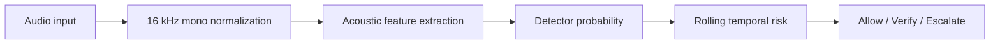

# VoiceCloneGuard Architecture

## High-level flow

## Implemented layers

### 1. Audio normalization
WAV and FLAC are decoded directly. Other supported formats are converted with FFmpeg to mono 16 kHz WAV before analysis.

### 2. Detector layer
Two adapters are supported:

- Original detector: 13 MFCC means + existing Random Forest artifact.
- Improved prototype: 13 MFCC means/std, delta and delta-delta statistics, spectral statistics, and spectral contrast statistics + Random Forest.

The application automatically prefers the improved artifact when present.

### 3. Rolling evidence
Uploads are evaluated in 4-second windows with a 1-second hop by default. Recent windows receive more weight than older windows.

### 4. Risk policy
The policy maps model evidence to workflow actions:

- `allow` — current evidence is below verification thresholds.
- `verify` — ask for an independent identity check.
- `escalate` — high-risk state with enough confidence for manual/security review.

### 5. Privacy
Only metadata/evidence objects are returned by the API. Uploaded audio is stored temporarily during decoding and then deleted from the server-side temporary paths.

## Research hooks not yet production-ready

`ood_score` and `speaker_consistency` are part of the data model and API contract, but the current prototype does not train a dedicated OOD detector or speaker-verification embedding model. They should therefore not be presented as fully implemented capabilities.
